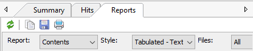

# Plunder
[](https://app.fossa.io/projects/git%2Bgithub.com%2Fbergren2%2Fplunder?ref=badge_shield)


Library for making sense of [Agent Ransack](https://www.mythicsoft.com/agentransack) results. Very much a WIP.

If you're looking for a solid SQLite tool, check out [DB Browser for SQLite](http://sqlitebrowser.org/).

## Agent Ransack



The results from Agent Ransack need to use the settings from above. Eventually we'll support other formats,
including those from other search tools.

## Usage

```python
import plunder

plunder.add_results_to_db("Report.txt", override=True)
```

This reads the tab-delimited results into `plunder.sqlite` so you can query to your heart's content.

## License

See LICENSE for details.


[](https://app.fossa.io/projects/git%2Bgithub.com%2Fbergren2%2Fplunder?ref=badge_large)